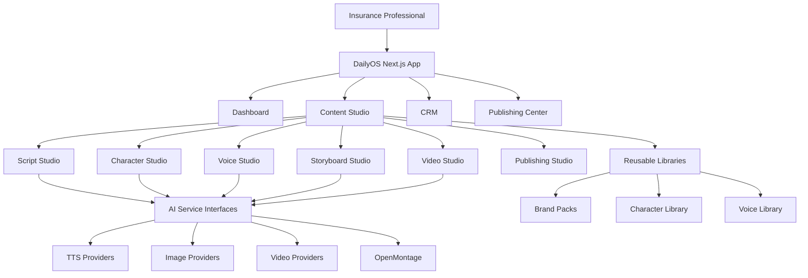

# DailyOS v1.0 Master Plan

## Purpose

DailyOS v1.0 is the architecture baseline for turning DailyOS into an AI Digital Creator OS for insurance professionals.

The product should stay focused on one user, one daily workspace, and one clear creator workflow: plan content, create reusable presenter assets, generate video-ready materials, and prepare publishing tasks with human approval.

## Product Direction

- Personal workspace first, not enterprise SaaS.
- Insurance workflow first: client trust, education, follow-up, and content planning.
- UI before backend: validate the workflow before adding persistence or automation.
- Provider-agnostic AI: keep TTS, image, video, and editing providers behind replaceable service boundaries.
- Human approval before automation: AI drafts and suggests; the user approves.

## System Architecture

## Core Application Layers

- `app/`: routing and page shells.
- `features/`: business modules such as dashboard, content, CRM, and publishing.
- `components/`: shared UI components.
- `lib/`: shared provider clients and service interfaces.
- `types/`: shared models for scripts, assets, profiles, and publishing records.
- `docs/`: architecture, setup, roadmap, and operating documents.

## End-to-End AI Video Production Workflow

1. Script Studio creates or imports the draft script.
2. Speech Optimizer rewrites the script into natural spoken language.
3. Voice Studio selects a reusable voice profile and prepares voice generation settings.
4. Storyboard Studio breaks the script into shots, subtitles, visuals, and b-roll notes.
5. Character Studio applies locked presenter identity rules to every scene.
6. Video Studio generates or assembles visual assets.
7. OpenMontage composes the final video with voiceover, subtitles, and timing.
8. Publishing Studio prepares platform captions, hashtags, status, and review tasks.

## The Six Studios

### 1. Script Studio

Purpose: turn insurance topics into clear, editable scripts.

Responsibilities:
- Topic and audience input.
- AI script generation.
- GPT prompt mode and manual paste workflow.
- Editable preview fields.
- Script library.
- Speech optimization handoff.

### 2. Character Studio

Purpose: keep presenter identity consistent across generated assets.

Responsibilities:
- Reusable character profiles.
- Multiple reference photos.
- Identity locks for face, hairstyle, hair color, outfit, body proportions, and visual style.
- Provider-agnostic identity prompt package.
- Handoff to storyboard image and video generation.

### 3. Voice Studio

Purpose: keep narration identity consistent and legally controlled.

Responsibilities:
- Reusable voice profiles.
- Legally owned voice sample imports.
- Speaking style, pauses, emphasis, speed, and emotional tone controls.
- Speech optimization before synthesis.
- Provider-agnostic TTS settings.

### 4. Storyboard Studio

Purpose: convert scripts into production-ready scenes.

Responsibilities:
- Shot list.
- Visual direction.
- Narration and subtitles.
- B-roll notes.
- Copyable storyboard package for AI image/video tools.

### 5. Video Studio

Purpose: prepare video assets and render prototypes.

Responsibilities:
- Character-locked image generation prompts.
- Video generation prompts.
- Clip assembly plan.
- OpenMontage render handoff.
- Export tracking.

### 6. Publishing Studio

Purpose: prepare content for distribution without automating posting too early.

Responsibilities:
- Platform-specific captions.
- Hashtags.
- Publishing status.
- Content calendar connection.
- Manual approval checklist.

## Brand Pack Specification

A Brand Pack stores the visual rules for reusable content.

Fields:
- Name.
- Primary colors.
- Accent colors.
- Font preferences.
- Logo or mark references.
- Subtitle style.
- Thumbnail style.
- Tone of voice.
- Compliance notes.
- Example prompt fragments.

Initial implementation can be local UI state. Persistence can come later when Supabase or another storage layer is added.

## Character Library Specification

A Character Library stores reusable presenter identities.

Fields:
- Profile name.
- Reference photo filenames or asset IDs.
- Face lock.
- Hairstyle lock.
- Hair color lock.
- Outfit lock.
- Body proportion lock.
- Visual style lock.
- Preferred scene style.
- Negative prompts or avoid rules.
- Provider-specific metadata when needed.

Keep the core profile provider-agnostic. Provider-specific fields should be optional adapter metadata.

## Voice Library Specification

A Voice Library stores reusable narration identities.

Fields:
- Profile name.
- Voice sample filenames or asset IDs.
- Ownership/consent note.
- Language.
- Speaking style.
- Speed.
- Pause style.
- Emphasis rules.
- Emotional tone.
- Provider-specific metadata when needed.

The user must confirm that uploaded samples are legally owned or permitted before synthesis is enabled.

## Knowledge Studio Roadmap

Knowledge Studio should help the user reuse trusted insurance knowledge without turning DailyOS into a generic document system.

Milestones:
- Add manual knowledge notes for common insurance explanations.
- Tag notes by product, audience, and compliance risk.
- Use notes as script context.
- Add citation or source reminders.
- Add retrieval only after the manual library proves useful.

## AI Director Roadmap

AI Director should coordinate suggestions across studios while keeping the user in control.

Milestones:
- Suggest missing production steps.
- Check whether a script has storyboard, voice, character, and publishing assets.
- Recommend next action on the dashboard.
- Warn about incomplete identity or brand settings.
- Later: orchestrate provider calls after the user approves each step.

## Recommended Technology Choices

- App framework: Next.js App Router.
- Language: TypeScript.
- Styling: Tailwind CSS and shadcn/ui components.
- AI boundary: service interfaces in `lib/ai`.
- Local video prototype path: OpenMontage in `vendor/OpenMontage`.
- Video composition: OpenMontage first, with Remotion or HyperFrames only when the specific render path needs it.
- Storage later: Supabase or another simple relational backend after UI workflows stabilize.
- Auth later: add only when multi-device or production deployment requires it.

## Integration Points

- Script generation: `/api/script` and future `lib/ai` script service.
- Speech optimization: provider-agnostic text transform before TTS.
- TTS generation: voice service interface.
- Image generation: image service interface using character and brand profiles.
- Video generation: video service interface using storyboard and character locks.
- Composition: OpenMontage render handoff.
- Publishing: manual queue first, platform APIs later.

## Prioritized Implementation Roadmap

### Milestone 1: Stabilize Studio UI

- Keep the current Content Studio usable.
- Make Script, Storyboard, Image, Digital Human, and Publishing workflows easier to scan.
- Avoid persistence until the final fields are clear.

### Milestone 2: Define Shared Models

- Script model.
- Storyboard shot model.
- Brand Pack model.
- Character profile model.
- Voice profile model.
- Publishing item model.

### Milestone 3: Local Libraries

- Store reusable scripts, brand packs, characters, and voices locally in the UI.
- Add import/export before database storage.

### Milestone 4: Provider Interfaces

- Move AI calls behind small service functions.
- Keep provider-specific settings out of UI components.
- Add one provider at a time.

### Milestone 5: Video Rendering Handoff

- Generate OpenMontage-compatible storyboard packages.
- Track render command, output path, and limitations.
- Keep UI integration manual until the render path is reliable.

### Milestone 6: Persistence and Auth

- Add database only after the studio models stop changing frequently.
- Add authentication only when deployment needs user accounts.

### Milestone 7: Automation

- Add reminders and next-action suggestions.
- Keep publishing and client communication manual until approval rules are clear.

## Guardrails for Future Issues

- One issue should change one workflow.
- Do not add database, authentication, or provider integrations unless the issue explicitly asks for them.
- Prefer reusable UI state and clear models before backend work.
- Keep provider-specific logic outside components.
- Every AI step should have visible user review before output is used downstream.
